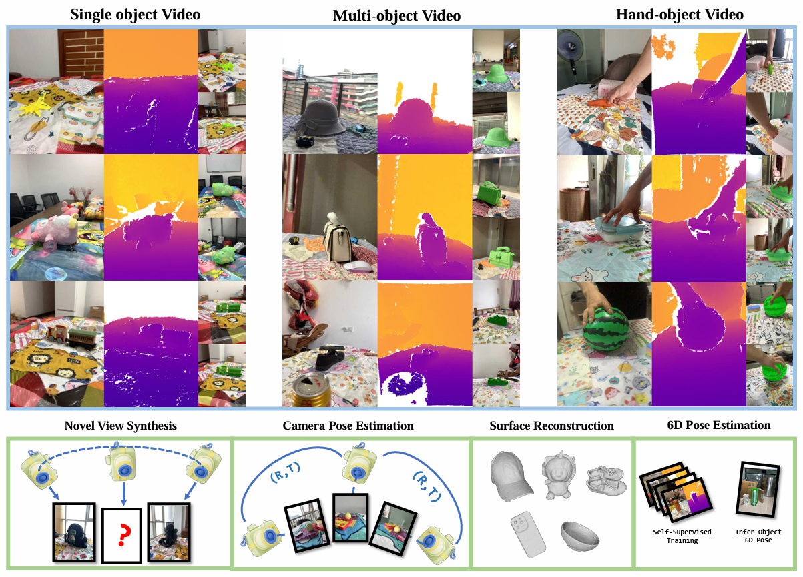

<h1>WildRGB-D</h1>

<center><h1>RGBD Objects in the Wild: Scaling Real-World 3D Object Learning from RGB-D Videos</h1></center>

<center><a href=https://scholar.google.com/citations?user=9iXQ-wsAAAAJ&hl=en target="_blank"> Hongchi Xia</a><sup>1*</sup>,<a href=https://scholar.google.com/citations?user=bioUtz4AAAAJ&hl=en target="_blank"> Yang Fu</a><sup>2*</sup>,<a href=https://scholar.google.com/citations?user=j4pcHV4AAAAJ&hl=en target="_blank"> Sifei Liu</a><sup>3</sup>,<a href=https://scholar.google.com/citations?user=Y8O9N_0AAAAJ&hl=en target="_blank"> Xiaolong Wang</a><sup>2</sup></center>
<br>
<br>
<center>
<sup>*</sup>Equal contribution <br>
<sup>1</sup>Shanghai Jiao Tong University, 
<sup>2</sup>University of California San Diego,
<sup>3</sup>NVIDIA <br>
</center>




## Usage

### Download

To download full WildRGB-D Dataset, it totally requires approximately 3.37T disk space to store zip packages, and approximately 4T to store all data.

To download all categories, execute `python download.py --cat all`.

To download specific one category, execute `python download.py --cat <category_name>`.

You could check all category names in the download scripts.

### Dataset format

```
WildRGB-D
    ├── <category_name>               
    │   ├── scenes
    │   │   ├── scenes_<scene_id>
    │   │   │   ├── rgb
    │   │   │   │   ├── <frame_id>.png
    │   │   │   │   |
    │   │   │   ├── depth
    │   │   │   │   ├── <frame_id>.png
    │   │   │   │   |
    │   │   │   ├── masks
    │   │   │   │   ├── <frame_id>.png
    │   │   │   │   |
    │   │   │   ├── metadata
    │   │   │   ├── cam_poses.txt
    │	├── types.json
    │	├── nvs_list.json
    │	├── camera_eval_list.json
```

### Dataset format details

1. `<category_name>/scenes/scenes_<scene_id>/depth/`: We store depths in the depth scale of 1000. That is, when we load depth image and divide by 1000, we could get depth in meters.
2. `<category_name>/scenes/scenes_<scene_id>/metadata`: It stores the camera intrinsics including image width, height and K.
3. `<category_name>/scenes/scenes_<scene_id>/cam_poses.txt`: It stores the camera extrinsics. For every line, we list the <frame_id> first, then following the flatten 4x4 extrinsic matrix. Our camera extrinsics follows OpenCV convention, and it's camera to world matrix.
4. `<category_name>/types.json`: It stores the video type of every scene in `<category_name>/scenes/`. It includes single object video marked in "single", multi-object video marked in "multi" and hand-object video marked in "hand".
5. `<category_name>/nvs_list.json`:  It stores the training and validation split we use in our Novel View Synthesis Task. For Single-Scene NVS, we only test on val split. For Cross-Scene NVS, we pre-train on train split and test on val split.
6. `<category_name>/camera_eval_list.json`:  It stores the training and validation split we use in our Camera Pose Evaluation Task.

### Generate point clouds

Our WildRGB-D Dataset provides point cloud annotations. Please refer to `wildrgbd_generate_point_cloud.py`.

### Contact us

If you have any problems when downloading and using WildRGB-D Dataset, please contact [Hongchi Xia](mailto:xiahongchi@sjtu.edu.cn) by email.
